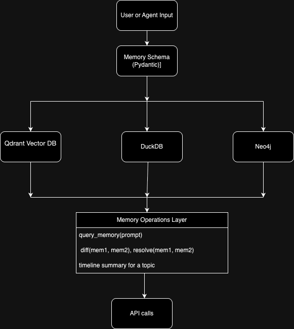

# MemoSynth-Lite

MemoSynth-Lite is a project that builds a lightweight memory system for Large Language Model (LLM) agents. It is designed to simulate how humans remember, retrieve, and resolve information over time. The project integrates vector search, timeline tracking, and graph-based reasoning using free and open-source tools.

## Project Goals

- Store structured memories with metadata such as timestamps, topics, and source information and uses Pydantic library to enforce schema.
- Perform semantic search on memory summaries using dense vector embeddings. Used the model all-mpnet-base-v2 for better vector embeddings.
- Log metadata like timestamps and topics using DuckDB.
- Track relationships between memories in a graph database (Neo4j).
- Build basic APIs to store, query, summarize, compare, and resolve memory data.
- Use transformer-based summarization models (BART, T5) and semantic search (MPNet).

## Key Features

### 1. Memory Storage

- Stores agent memories as Python objects following a Pydantic schema.
- Embeds memory summaries using `all-mpnet-base-v2` (a SentenceTransformer model).
- Each memory contains metadata like summary, tags, topic, timestamp, sensitivity, and confidence.

### 2. Vector Search (Qdrant)

- Summaries are encoded and stored in Qdrant, enabling semantic vector search.
- Each memory includes a topic field, allowing the system to filter embeddings by topic during queries. This ensures cleaner, more relevant results and prevents vector space contamination across unrelated topics.
- Supports `query_memory(prompt)` to find related memories using cosine similarity.

### 3. Timeline Logging (DuckDB)

- Memory timestamps are logged into DuckDB (`memory_log` table).
- Ensures chronological tracking and historical auditing.

### 4. Knowledge Graph (Neo4j)

- Each memory is represented as a node in a Neo4j graph.
- Memory relationships and entities can be extended in future stages.

### 5. Summarization

This project uses two summarization models based on the needs of the environment and the input content.

- facebook/bart-large-cnn is the primary model used. It performs well on longer text inputs like news articles and insights. The summaries it produces are clear, informative, and capture the essence of the input without losing important context.

- t5-small is used as a lighter alternative when system resources are limited. It's faster and works well for shorter descriptions or sentences, especially in quick or constrained environments.

To evaluate the effectiveness of each model, a simple benchmarking script was used. This script tests different models on the same input set and compares the generated summaries based on content quality, length, and runtime performance.


### 6. Diff + Conflict Resolution

- Compares two memory summaries for differences using `diff()`.
- Resolves contradictions with a GPT-based model (OpenAI's `gpt-3.5-turbo`).

### 7. Timeline Summarization with DuckDB

To understand how a topic evolves over time, MemoSynth-Lite integrates a simple temporal summarization layer using DuckDB.

All memory events are logged in the `memory_log` table within DuckDB, including `id`, `summary`, `timestamp`, and `version`.

We can run SQL queries like this to extract all entries related to a specific topic (e.g., Q2) ordered chronologically:

```python
query = """
SELECT *
FROM memory_log
WHERE summary ILIKE '%Q2%'
ORDER BY timestamp
"""
df = con.execute(query).fetchdf()
print(df)
```
### Architecture Diagram



## How to Run

1. Clone the repository and create a virtual environment.
2. Add your `OPENAI_API_KEY` and `NEWSDATA_API_KEY` in a `.env` file.
3. Start Qdrant and Neo4j using Docker.
4. Run `scripts/run_demo.py` to simulate end-to-end flow.


## Dependencies

- `sentence-transformers`
- `qdrant-client`
- `duckdb`
- `neo4j`
- `transformers`
- `pydantic`
- `openai`
- `dotenv`
- `requests`


